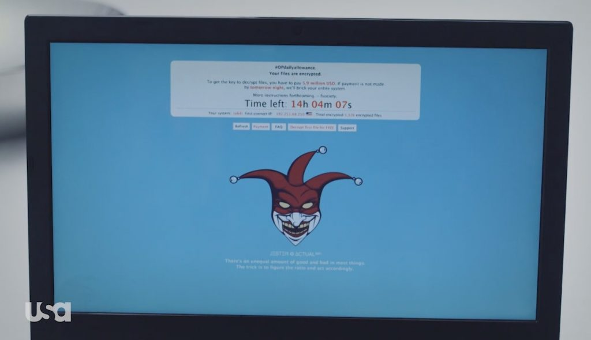
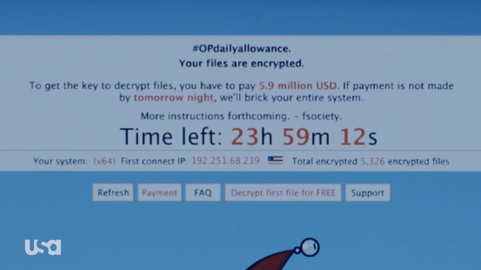

# fsociety-ransomware-mockup
As part of the ransom demand, fsociety forces Scott Knowles to wear an fsociety mask and publicly burn the $5.9 million from the previous episode's hack.

From Mr Robot Season 2 Episode 1 "eps2.0_unm4sk-pt2.tc"

This webpage is an homage to fsociety's randsomware. The website doesn't do anything other than start a countdown and read some information about your system.

